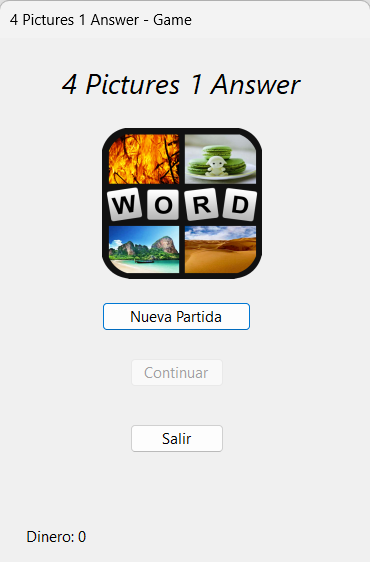
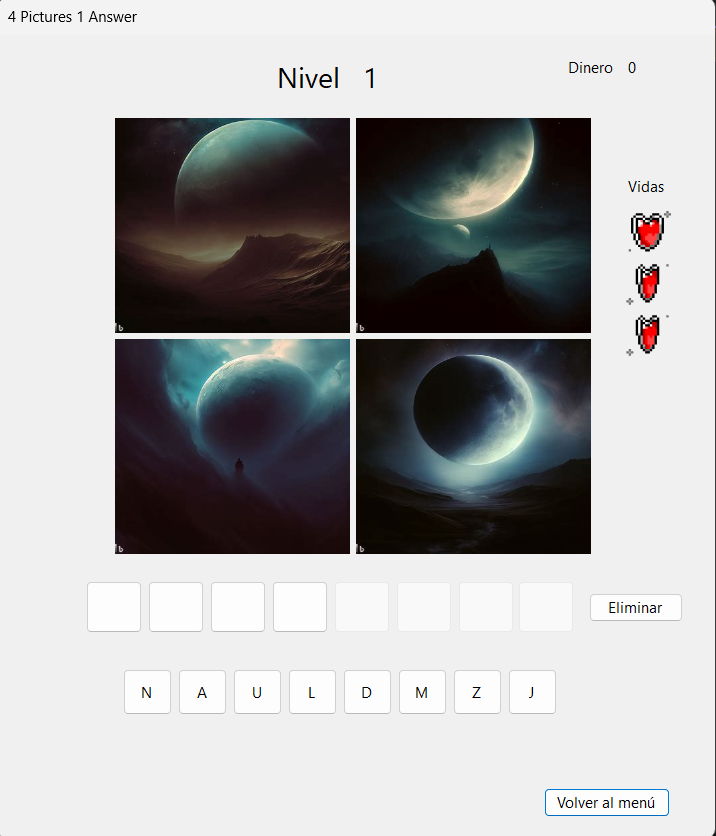

# 4 Pictures 1 Word - Hangman Edition

An easy game made in c# with the purpose of learning the language, its kinda interesting and maybe you can have fun of it, do whatever you want with it, its free.

## How to use

Like the title of this game says, its some kind of mix from the popular game for android "4 Pictures 1 Word", but with Hangman Mechanics. You have 3 live and money! (but its useless, i haven't made the "shop" yet).

## Showcase

### Menu

### Gameplay (I guess?)

### Translation

I know, by the moment, the game is only in spanish, but i will translate it to english soon. :D
